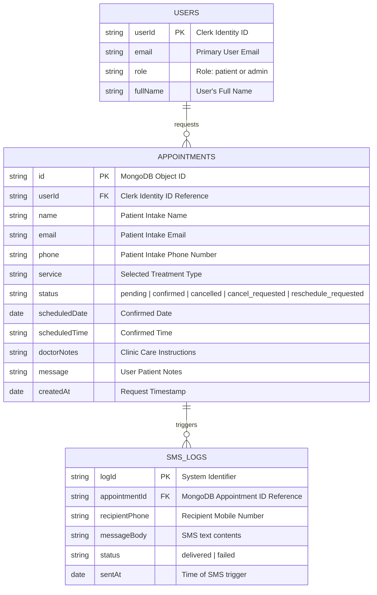
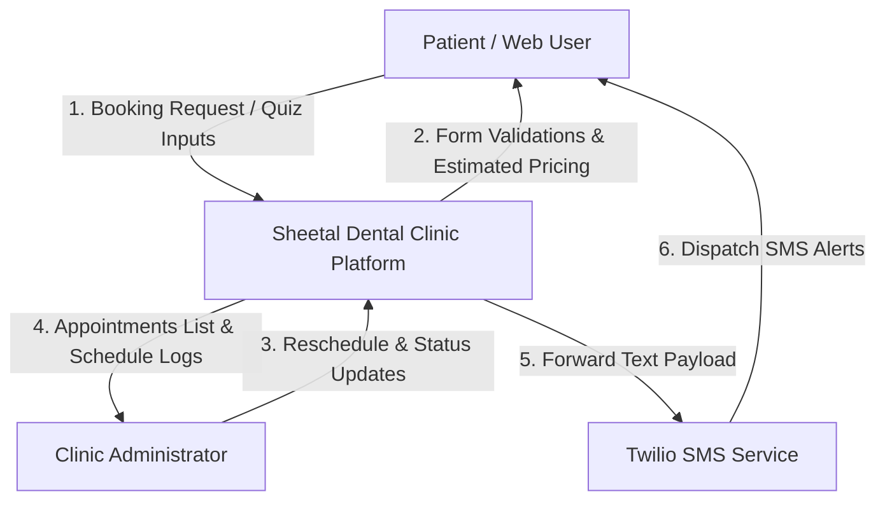
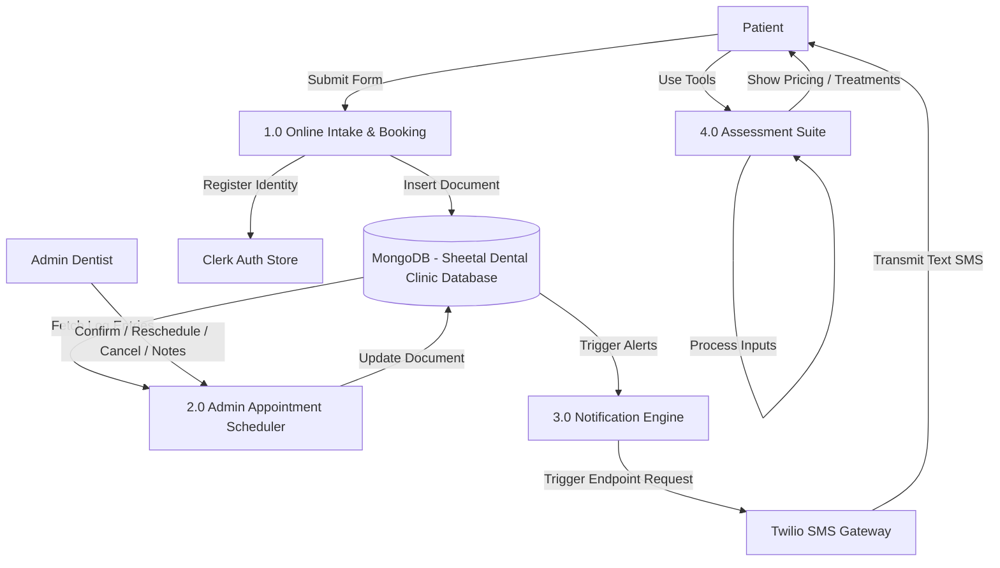
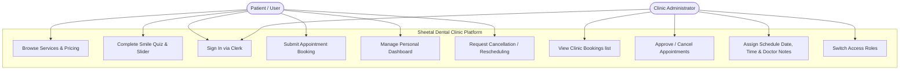
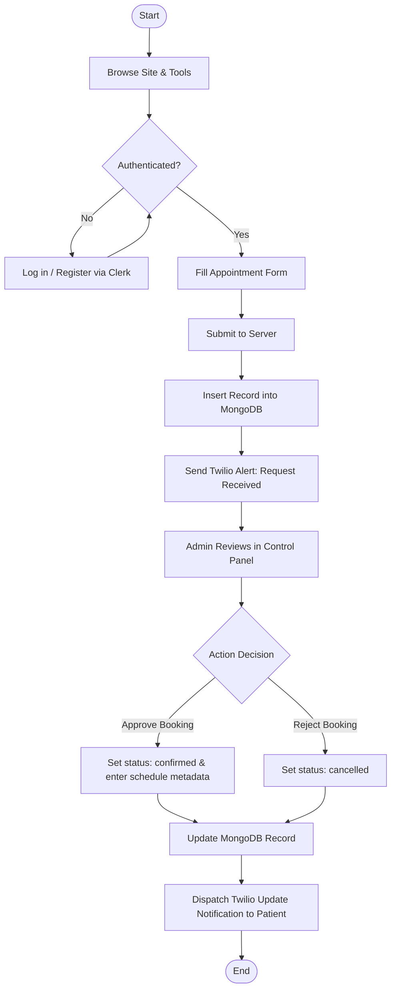

# Project Report: Sheetal Dental Clinic Booking and Management Platform

---

## CHAPTER 1: INTRODUCTION

### 1.1 Background
In the contemporary healthcare landscape, digital systems have shifted from being optional amenities to essential operational infrastructure. Sheetal Dental Clinic, a provider of comprehensive cosmetic, restorative, and general dentistry, relies on creating a seamless and gentle experience for patients from their first point of contact. Historically, patient scheduling and consultation preparation were conducted via manual telephone interactions or paper logs, introducing operational friction and administrative overhead. By deploying an advanced, web-based appointment booking and patient assessment portal, the clinic can digitize and optimize its scheduling workflow. Utilizing modern frameworks like Next.js, Clerk authentication, and MongoDB, this platform automates the intake pipeline, provides interactive self-assessment tools, and dispatches automated SMS confirmation alerts to improve patient throughput and satisfaction.

### 1.2 Problem Statement
Sheetal Dental Clinic's traditional appointment booking process is highly reliant on manual scheduling, leading to patient phone wait times, front-desk scheduling conflicts, and human recording errors. Furthermore, patients lack a transparent mechanism to estimate treatment costs beforehand or visualize treatment outcomes (such as orthodontic before-and-after results), which contributes to hesitation in booking procedures. The absence of a real-time patient notification loop and an easily accessible patient history portal increases appointment no-shows and strains administrative resources during peak clinic hours.

### 1.3 Purpose of Project

#### Issues with the Existing System
* **Inconvenient Booking Channels:** Patients must call during clinic hours, leading to missed booking opportunities during weekends or off-hours.
* **Lack of Cost Transparency:** Administrative staff spend significant time explaining pricing variations for multiple dental treatments over the phone.
* **Manual Record Management:** Paper-based or local logs make it difficult for doctors to retrieve patient history, schedule dates, or add treatment notes instantly.
* **No Automated Reminders:** The manual dispatch of SMS/calls for appointment confirmation is tedious and prone to human omission, resulting in higher cancellation and no-show rates.

#### How the Proposed System Solves These Problems
* **24/7 Digital Intake Portal:** Patients can request appointments securely at any time using their mobile device or desktop.
* **Interactive Diagnostic Tools:** The integration of a Smile Quiz, Pricing Calculator, and before-and-after Smile Slider lets users self-assess their dental needs and estimate costs prior to checking in.
* **Centralized Admin Dashboard:** The clinic staff can filter, search, reschedule, and delete appointments digitally, while appending persistent doctor notes directly to patient records in a MongoDB collection.
* **Automated SMS Dispatch System:** The system integrates Twilio API triggers that automatically send real-time confirmation texts, reschedule alerts, or cancellation warnings directly to the patient's phone.

### 1.4 Objectives of the Project
* **To design and implement** a responsive, user-friendly frontend interface that simplifies dental appointment scheduling for patients.
* **To integrate secure, role-based authentication** using Clerk API to separate patient and administrative view rights.
* **To build a dynamic clinic database** with MongoDB to store, retrieve, update, and delete patient appointment metadata securely.
* **To deploy interactive patient tools**, specifically a dental Treatment Cost Calculator, an diagnostic Smile Quiz, and an orthodontic Smile Slider to increase online booking conversions.
* **To establish an automated notification gateway** using Twilio SMS to verify bookings, announce scheduling times, and communicate doctor instructions.

### 1.5 Scope of the Project

#### 1.5.1 Features (Currently Delivering)
* **Clerk Authentication Engine:** Restricts dashboard views based on custom user roles (e.g., patient vs. admin).
* **Interactive Patient Landing Page:** Built with custom Tailwind CSS v4 styling, fluid scroll effects, and dark/light theme options.
* **Three Patient Utility Tools:**
  1. **Smile Slider:** A dual-image drag-slider illustrating before-and-after treatment outcomes.
  2. **Smile Quiz:** A multi-step React form analyzing dental complaints and recommending treatments.
  3. **Pricing Calculator:** React-driven estimator listing cost projections for selected dental codes.
* **MongoDB Database Backend:** Handles CRUD operations via REST API endpoints for booking management.
* **SMS Gateway:** Automated Twilio SMS generation triggered when appointments are created, confirmed, rescheduled, or cancelled.
* **Admin Control Center:** Allows the doctor to confirm bookings, designate dates/times, and write treatment directions.

#### 1.5.2 Exclusions (Future Scope)
* **Payment Gateway Integration:** The current application calculates pricing but does not process credit cards or UPI payments online; payments are conducted physically at the clinic.
* **Automated Doctor Calendar Sync:** The admin manually sets the date and time of appointments on confirmation rather than checking an integrated, real-time Google Calendar/Outlook sync of the doctors.
* **Teledentistry Video Consultations:** Direct video calls between the dentist and patients are not supported in this version.
* **Electronic Health Records (EHR) Storage:** Uploading and parsing raw dental X-rays or extensive historical medical records is currently excluded.

---

## CHAPTER 2: LITERATURE SURVEY

### 2.1 System Name 1: Tend Dental
* **Website:** [Tend Dental](https://www.hellotend.com)
* **Brief Description:** Tend is a modern, technology-focused dental care provider based in the United States. It offers an online appointment scheduling platform that enables users to book slots at physical clinics, fill out medical intake forms, select specific dental practitioners, and check insurance co-pays in advance. The platform emphasizes transparency and premium customer experience.
* **Feature List:**
  * Real-time calendar availability selection.
  * Integration with dental insurance systems for real-time co-pay estimation.
  * Direct selection of individual dentists with bios.
  * Secure patient login and digital intake forms.
  * SMS and Email appointment reminders.
* **Technology Overview:**
  * **Frontend:** React, Next.js, styled-components.
  * **Backend:** Node.js API services hosted on AWS Cloud.
  * **Database:** Relational PostgreSQL database for patient and clinical logs.
  * **Third-Party Integrations:** Dental practice management software (PMS) APIs, Twilio SMS.

### 2.2 System Name 2: Clove Dental
* **Website:** [Clove Dental](https://clovedental.in)
* **Brief Description:** Clove Dental is India's largest network of dental clinics, operating hundreds of clinics across multiple states. Their website provides clinic finders, service descriptions, pricing overviews, and appointment inquiry forms. It focuses heavily on geographical distribution and marketing individual treatments.
* **Feature List:**
  * Clinic locator with Google Maps integration.
  * Appointment request form (lead generation style).
  * Comprehensive service categories with text explanations.
  * Patient reviews and testimonial highlights.
  * Integration with backend CRM to routing leads to local clinics.
* **Technology Overview:**
  * **Frontend:** HTML5, CSS3, JavaScript, jQuery.
  * **Backend:** PHP / WordPress CMS.
  * **Database:** MySQL database hosting content and form submissions.
  * **Third-Party Integrations:** Localized SMS gateways, CRM lead management integration.

### 2.3 Bibliography
1. Robin Nixon, *Learning PHP, MySQL & JavaScript*, 6th Edition, O'Reilly Media, 2021.
2. Jon Duckett, *HTML and CSS: Design and Build Websites*, John Wiley & Sons, 2011.
3. Jon Duckett, *JavaScript and jQuery: Interactive Front-End Web Development*, John Wiley & Sons, 2014.
4. Ian Sommerville, *Software Engineering*, 10th Edition, Pearson Education, 2015.
5. Next.js Documentation, *Next.js App Router Paradigm*, Vercel, 2025.
6. MongoDB Manual, *MongoDB Driver CRUD Operations*, MongoDB Inc., 2026.

---

## CHAPTER 3: SYSTEM REQUIREMENTS & DESIGN

### 3.1 System Modules

#### 1. Authentication & Role Switcher Module
Utilizing Clerk API, this module logs in users, handles signup flows, and extracts metadata roles. For development testing, a role switcher endpoint `/api/user/toggle-role` allows switching metadata between "patient" and "admin" roles.

#### 2. Landing Page & Interactive Tools Module
Houses the patient intake tools:
* **Smile Quiz:** Multi-step React form analyzing dental complaints and recommending treatments.
* **Smile Slider:** HTML/CSS slider visualizing orthodontic progress.
* **Pricing Calculator:** React-driven estimator listing cost projections for selected dental codes.

#### 3. Patient Appointment Management Module
Enables authenticated patients to fill the appointment request form. It displays their bookings dynamically, letting them submit cancellation requests (`status: cancel_requested`) or choose new rescheduling options (`status: reschedule_requested`).

#### 4. Admin Booking Controller Module
A secure panel at `/admin` displaying all clinic appointments. Administrators can search bookings, delete outdated entries, input appointment dates and times, write persistent doctor instructions, and confirm requests (`status: confirmed`).

#### 5. SMS Notification Engine
A server-side utility ([lib/sms.ts](file:///c:/Users/vibhas%20pawar/Downloads/dental-clinic-website/lib/sms.ts)) connected to the Twilio REST API. It is triggered by API actions to format and transmit customized texts when appointments are requested, updated, scheduled, or cancelled.

---

### 3.2 Hardware and Software Requirements

#### 3.2.1 Hardware Requirements
* **Client / Developer Workstation:**
  * **CPU:** Intel Core i3 / Ryzen 3 or higher.
  * **RAM:** 8 GB DDR4 or higher.
  * **Storage:** 120 GB SSD free space.
  * **Peripherals:** Standard Keyboard, Mouse, and High-Definition Monitor.
* **Production Web Hosting Server (Cloud):**
  * **Hosting Environment:** Vercel / AWS Lambda environment.
  * **Database Cluster:** MongoDB Atlas Cloud Instance.

#### 3.2.2 Software Requirements
* **Frontend Technologies:**
  * Next.js 16 (React 19 framework)
  * Tailwind CSS v4 (Styling)
  * Lucide React (Vector Icon Library)
  * Framer Motion (Transitions and Scroll Effects)
* **Backend Technologies:**
  * Node.js Runtime (v20+)
  * Next.js Server Components and Route Handlers
* **Database Management System:**
  * MongoDB (NoSQL Document Store)
* **API Gateways:**
  * Clerk Auth SDK (User Identity)
  * Twilio SDK (SMS Alerts)
* **Development Environment:**
  * Visual Studio Code (IDE)
  * Git (Version Control)
  * Web Browsers (Chrome / Edge / Firefox)

---

### 3.3 Planning and Scheduling

#### 3.3.1 Gantt Chart (Planned vs Actual)
Below is the project implementation timeline tracked over a 12-week span:

```
+-----------------------------------+--------------------+------------------------+----------+
| Phase & Description               | Planned Timeline   | Actual Timeline        | Status   |
+-----------------------------------+--------------------+------------------------+----------+
| Phase 1: Requirements Gathering   | Week 1 - 2         | Week 1 - 2             | Complete |
| Phase 2: UI/UX & Database Design  | Week 2 - 3         | Week 2 - 3             | Complete |
| Phase 3: Setup Next.js & Clerk    | Week 4             | Week 4                 | Complete |
| Phase 4: Database Setup (MongoDB) | Week 5             | Week 5 - 6             | Complete |
| Phase 5: Develop Interactive Tools| Week 6 - 8         | Week 6 - 8             | Complete |
| Phase 6: Admin Dashboard Core     | Week 8 - 9         | Week 8 - 9             | Complete |
| Phase 7: Twilio SMS Integration   | Week 9 - 10        | Week 9 - 10            | Complete |
| Phase 8: Testing & Bug Rectification| Week 11          | Week 11 - 12           | Complete |
| Phase 9: Report & Documentation   | Week 12            | Week 12                | Complete |
+-----------------------------------+--------------------+------------------------+----------+
```

---

### 3.4 Conceptual Models

#### 3.4.1 ER (Entity-Relationship) Diagram
Below is the conceptual model of the database collections showing relations between registered Clerk users, appointment logs, and SMS updates:



---

#### 3.4.2 Data Dictionary

##### Collection: `appointments`
This collection stores patient booking requests and scheduling info.

| Field Name | Data Type | Key Type | Nullable | Description |
| :--- | :--- | :--- | :--- | :--- |
| `_id` | ObjectId | PK | No | Unique identifier generated by MongoDB. |
| `userId` | String | FK | Yes | Associates appointment with Clerk user profile (null for guests). |
| `name` | String | - | No | Patient's first and last name. |
| `email` | String | - | No | Contact email address for records. |
| `phone` | String | - | No | Recipient phone number for SMS triggers. |
| `service` | String | - | No | Type of service requested (e.g., Cleanings, Fillings). |
| `status` | String | - | No | Status tag: `pending`, `confirmed`, `cancelled`, etc. |
| `scheduledDate` | String/Date| - | Yes | Confirmed date assigned by the dentist/admin. |
| `scheduledTime` | String | - | Yes | Confirmed time slot assigned by the dentist/admin. |
| `doctorNotes` | String | - | Yes | Custom comments/instructions left by the dentist. |
| `message` | String | - | Yes | Additional notes typed by patient at checkout. |
| `createdAt` | Date | - | No | System timestamp when booking record was created. |

---

#### 3.4.3 Data Flow Diagram (DFD)

##### Level 0: Context Diagram


##### Level 1: Functional DFD


---

#### 3.4.4 Use Case Diagram


---

#### 3.4.5 Activity Diagram
The flowchart below traces the process of scheduling an appointment online, updating its status, and generating notifications:


